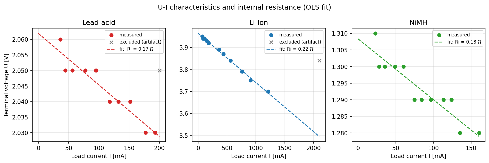
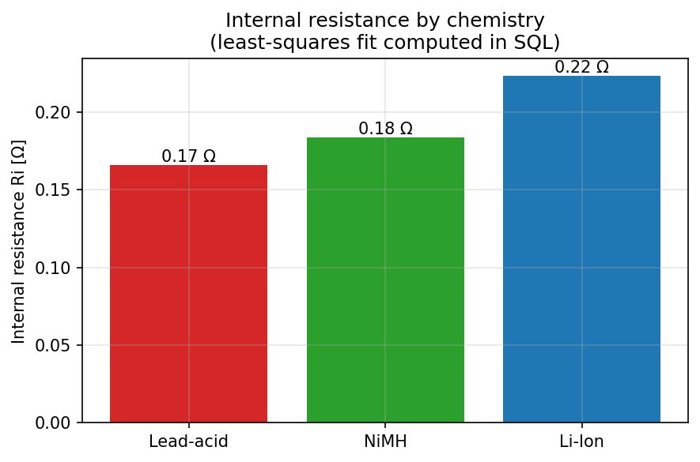
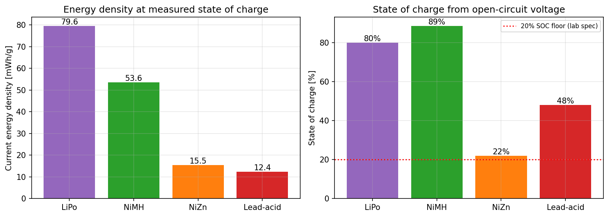
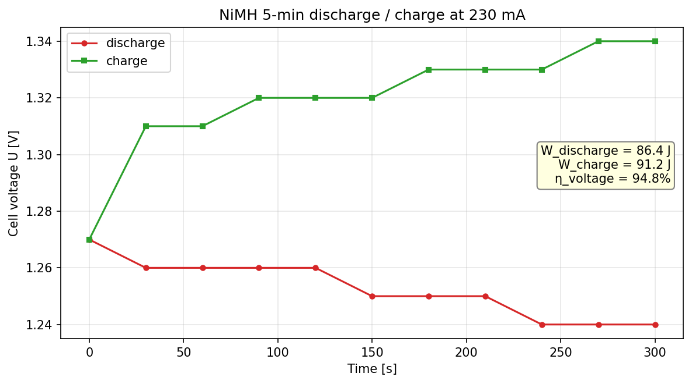

# Green-Energy Lab Analytics — SQL + Python pipeline on real experimental data

End-to-end analysis of **two university lab courses** (WHZ Zwickau) plus a set of
regulator/capacitor transient recordings:

* **RE04 — Electrochemical storage:** Faraday constant, battery KPIs, internal
  resistance, NiMH cycle efficiency
* **RE05 — Hydrogen technologies:** double-cell electrolyzer (efficiencies,
  overpotential), PEM fuel cell, solid oxide fuel cell
* **Energy management:** five regulator topologies charging a capacitor (26k
  samples), capacitor discharge time constants
* **Production Planning & Control business game:** 4 lean improvement rounds,
  8 batches, 7 workstations — cycle times, waiting times, bottleneck analysis

Messy Excel sheets are turned into a clean SQLite database, analyzed **primarily
in SQL**, and visualized with matplotlib and two interactive Chart.js dashboards.

The point of this repo is less the electrochemistry and more the workflow:
**messy real-world data → tidy relational model → SQL metrics → dashboards → findings.**

## Pipeline

```
data/raw/*.xlsx ──► src/01_etl.py ──► outputs/battery_lab.db (SQLite, 4 tables)
                                      │
                    sql/analysis_queries.sql (all metrics computed in SQL)
                                      │
                    src/02_analysis.py ──► outputs/results_summary.md
                    src/03_visualize.py ──► outputs/figures/*.png
                    notebooks/analysis.ipynb ──► executed walkthrough (renders on GitHub)
                    dashboard/index.html ──► interactive dashboard (Chart.js)

RE05 + regulator data follow the same pattern:
                    src/04_etl_re05.py ──► 9 more tables (26k+ rows)
                    sql/analysis_re05_queries.sql (Q5–Q10, all in SQL)
                    src/05_analysis_re05.py ──► outputs/results_summary_re05.md
                    src/06_visualize_re05.py ──► 4 more figures
                    dashboard/hydrogen.html ──► second dashboard page

PPC business game:  src/07_etl_ppc.py ──► 3 tables (Rounds 1/3 measured)
                    sql/analysis_ppc_queries.sql (Q11–Q13)
                    src/08_analysis_ppc.py + src/09_visualize_ppc.py
                    dashboard/production.html ──► third dashboard page
```

**PPC data-provenance findings (the analyst part):** the ROUND_1/2/3 workbooks
turned out to be content-identical copies — Rounds 2/3 raw data was never saved,
so their KPIs are sourced from the report and labelled as such. The file named
"round 4" actually contains the **Round 3 measurements** (its batch cycle times
reproduce the report's Round-3 table), which also exposed one transposed value
in the report (58:59 vs. 59:49 in the source). Headline results, all in SQL:
production horizon **125 → 58 min (−54%)** across rounds, waiting share of cycle
time **65% → 28%**, and the bottleneck shifting from Rework (46% of load) to
Assembly 1 after decentralizing quality control.

**▶ Interactive dashboard:** open `dashboard/index.html` in any browser — chemistry
tabs on the U-I chart, hover tooltips, SQL-computed KPI readouts. Host it free with
GitHub Pages (repo Settings → Pages → deploy from branch) and it's live at
`https://<user>.github.io/battery-lab-analytics/dashboard/`.

**▶ Executed notebook:** [`notebooks/analysis.ipynb`](notebooks/analysis.ipynb) —
code, SQL, and results together; GitHub renders it without running anything.

Run it:

```bash
pip install -r requirements.txt
python src/01_etl.py
python src/02_analysis.py
python src/03_visualize.py
```

## Data-quality issues found & fixed during ETL

Real lab data is messy. The raw sheet contained:

* **Mixed locales** — German decimal commas (`4,2`) next to dot-decimal floats in the same column
* **A broken formula** — the energy-density cell for the LiPo battery referenced header cells (`=M2*G2/I2`) instead of data cells, silently producing no value. The metric is recomputed from raw columns in SQL (`Q2`), which also validated the three values that *were* correct
* **Measurement artifacts** — a voltage-rebound point in the Li-Ion U-I sweep and current clipping at the 200 mA instrument limit for lead-acid. Both are excluded from the regression fit region with documented `WHERE` clauses (`Q3`)
* **Layout, not tables** — four experiments arranged spatially on one sheet, normalized into four relational tables (see `sql/schema.sql`)

## Analyses (all in SQL — see `sql/analysis_queries.sql`)

| # | Question | Method | Result |
|---|----------|--------|--------|
| Q1 | Faraday constant from copper electrolysis | Q = I·t, F = Q·M/(z·Δm) | **93,253 C/mol** from anode mass loss (−3.4% vs. literature 96,485). Cathode side deviates +17% — copper detaching into solution instead of depositing, a known systematic error |
| Q2 | Battery KPIs: SOC, remaining capacity, energy density | Recomputed metric + `RANK()` window function | LiPo leads at **79.6 mWh/g**, ~6.4× lead-acid (12.4) — matching the theoretical chemistry ranking |
| Q3 | Internal resistance per chemistry | **Ordinary-least-squares regression written in pure SQL** on the U-I curve (U = U₀ − Rᵢ·I) | Lead-acid 0.17 Ω, NiMH 0.18 Ω, Li-Ion 0.22 Ω |
| Q4 | NiMH round-trip efficiency (5 min discharge/charge @ 230 mA) | Trapezoidal integration via `LAG()` window functions | W_dis = 86.4 J, W_chg = 91.2 J → **94.8% voltage efficiency**. Full-cycle energy efficiency would be lower (65–85% typical) since a 5-minute partial cycle excludes coulombic and end-of-charge losses |

## Analyses — RE05 hydrogen lab + regulators (`sql/analysis_re05_queries.sql`)

| # | Question | Method | Result |
|---|----------|--------|--------|
| Q5 | Electrolyzer Faradaic & energy efficiency at two loads | Gas volume vs. charge-equivalent volume (V_M = 24.05 L/mol) | 3 Ω run: **η_F = 78.8%**, η_E = 69.6%. The 5 Ω run reads >100% — flagged: both runs recorded an identical 15 mL despite 43% more current at 3 Ω, pointing to the ±1 mL gas-column resolution |
| Q6 | Electrolyzer overpotential | OLS on the I-U curve in SQL; 100 Ω point excluded as a recording error | Decomposition voltage **3.05 V** (1.53 V/cell) → overpotential **0.59 V** above the 2 × 1.23 V thermodynamic minimum |
| Q7 | PEM cell maximum power | MPP from P = U·I; ohmic-region fit excludes the documented mid-measurement restart and the diffusion-limited knee | **P_max = 57.7 mW at 4 Ω**; Ri = 5.1 Ω from fit ≈ load at MPP (impedance matching, a built-in sanity check) |
| Q8 | SOFC power & efficiency | Same fits + trapezoidal energy vs. burner mass loss × butane LHV | **P_max = 31.1 mW at 2 Ω** (Ri = 2.7 Ω ✓); demo-cell energy efficiency ≈ **0.011%** — the flame heats far more than the cell converts |
| Q9 | Capacitor discharge time constants | ln-linear OLS **in SQL** on the resistive decay region (current-limit plateau and noise floor excluded) | τ = 1.0 / 2.1 / 1.0 s across the three runs |
| Q10 | Regulator topology comparison | Trapezoidal ∫U·I dt per topology via `LAG()` | **MPP + Shunt delivers the most energy (3.29 J in 25 s)** — 14× the plain shunt regulator; PWM holds the highest voltage but its recording window is shorter |

Additional data-quality issues handled in the RE05 ETL: German decimal commas inside
free-text weight cells (`cell weight=89,9205 g`), a missing power reading at t=0 in the
stack run (kept as NULL, integration starts at the first valid sample), two ambiguous
burner weighings (both stored, assumption documented), and five side-by-side recording
blocks auto-detected by header position.

## Figures

| | |
|---|---|
|  | U-I characteristics with fit lines; excluded artifacts marked |
|  | Internal resistance comparison (regression done in SQL) |
|  | Energy density & SOC KPI view |
|  | Discharge/charge curves with computed efficiency |

## Stack

Python (pandas, openpyxl, numpy, matplotlib) · SQLite (window functions, CTEs, in-SQL regression) · Excel as the raw source

## Repo layout

```
├── data/raw/                  original lab workbooks (untouched, 7 files)
├── sql/
│   ├── schema.sql             relational model (RE04)
│   ├── analysis_queries.sql   Q1–Q4 · batteries
│   └── analysis_re05_queries.sql  Q5–Q10 · hydrogen + regulators
├── dashboard/
│   ├── index.html             batteries dashboard (Chart.js, GitHub Pages ready)
│   └── hydrogen.html          hydrogen & regulators dashboard
├── notebooks/analysis.ipynb   executed notebook (RE04 walkthrough)
├── src/
│   ├── 01_etl.py … 03_visualize.py     RE04 pipeline
│   └── 04_etl_re05.py … 06_visualize_re05.py  RE05 + regulator pipeline
└── outputs/                   database (16 tables), reports, 11 figures
```
